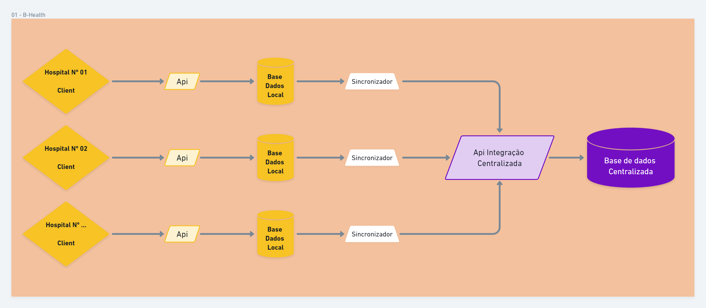
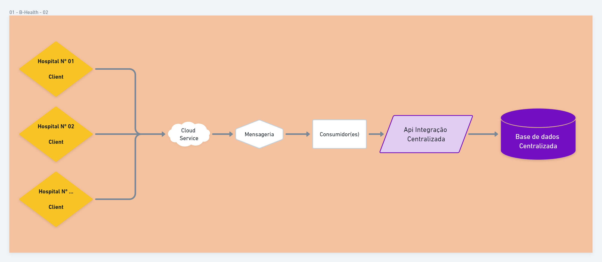

## **01 - Problema de integração/atualização por troca de arquivos via FTP.**

* [Desenho da Solução](https://whimsical.com/01-b-health-STtPbqzDjYUZ3cjogaUYYs "Whimsical - Desenho da Solução")
---

## **Solução 01 - Centralização de gerênciamento de informações - Integração via Api**
  * Substituir a integração diária via arquivo por integrações periódias efetuando sincronização das bases de registro de exame com o sistema que
  é responsável pelo gerenciamento central das informações no banco de dados via API.
    * Cada Hospital teria uma base de dados local para gerênciar os exames.
    * Cada registro de exame seria gravado nessa base de dados no momento do lançamento e geraria um evento de gravação.
    * Períodicamente os registros seriam enviados para o serviço responsável pela base de dados geral dos hospitais.
      * As integrações periódicas teriam um curto período de dessincronismo.
      * Em caso de indisponibilidade do serviço centralizado, a próxima tentativa de integração resolveria a falha anterior.

---

## **Solução 02 - Centralização de gerênciamento de informações - Geração de**
  * Substituir a integração diária via arquivo por integrações periódias onde cada registro de exame geraria um evento para um serviço de mensageria
  que seria reponsável por integrar os registros com a base de dados centralizada via API.
    * Cada Registro de exame geraria um evento que seria disparado para um consumidor ser reponsável por integrar diretamente com o 
    serviço centralizador.
    * Períodicamente os registros seriam enviados para o serviço responsável pela base de dados geral dos hospitais.
      * As integrações periódicas teriam um curto período de dessincronismo.
      * Em caso de indisponibilidade do serviço centralizado, retentativas seriam feitas até que o serviço fosse reestabelecido.

---
[Voltar](../README.md "Voltar")