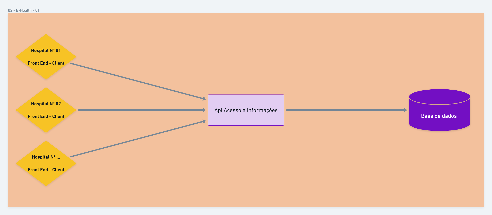

## **02 - Problema de concorrência de acesso a base de dados.**

* [Desenho da Solução](https://whimsical.com/02-b-health-GfgJXG1GCFiGLg8FncJPrK "Whimsical - Desenho da Solução")
---

## **Solução 01 - Centralizar acesso a base e aplicar 'Repository Pattern' com gerenciamento 'Singleton' de acesso a base de dados.**
  * Desacoplar o front-end do back-end.
  * Criar uma API única para acesso a base de dados.
    * Aplica padrão de acesso a dados de forma gerenciada.
      * Limitar o número de conexões abertas por requisição.
      * Implementar padrão singleton com gerenciamento de abertura e fechamento de seções.
  * Front-end deverá consultar as informações através da API criada.

---
[Voltar](../README.md "Voltar")